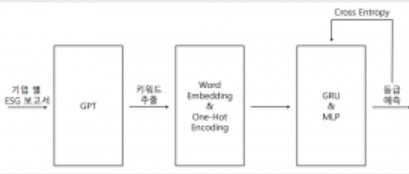

# khuthon_2024

## 프로젝트 목표 및 설명
안녕하세요 주하상영 조입니다. 이번 KHUTHON 2024 주제로 ESG 기업 간의 지속경영보고서 내용을 이용하여 정보를 추출하여 이를 평가 지표로 만들어서 상대적으로 다른 기업과의 비교를 할 수 있도록 하는 시스템을 만들었습니다. 아쉽게도 KHUTHON 종료시점까지 미완성과 한계에 부딪쳤습니다. 그래도 OPENAI를 이용하여 CHATGPT, Pytorch로 Embedding vector을 이용하여 벡터로 나타내어서 나타내는 프로그램을 만들었습니다.
이에 대해서 참고 레퍼런스 링크는 다음과 같이 나타냅니다.

## 프로젝트 과정
1. PDF에 있는 구성요소를 추출합니다.
2. 추출한 구성요소를 통해서 OPENAI-API를 통해 키워드추출합니다.
3. 이를 통해서 ESG 평가 지표에 대해서 결과를 도출합니다.

## 참고문헌
|제목|링크|
|----|---|
|OPENAI_API_quickstart|https://platform.openai.com/docs/quickstart|
|Pytorch|https://pytorch.org/docs/stable/index.html|
|KKma(Konlpy)|https://konlpy.org/ko/latest/api/konlpy.tag/#module-konlpy.tag._kkma|

## 파이프라인(Pipeline)

